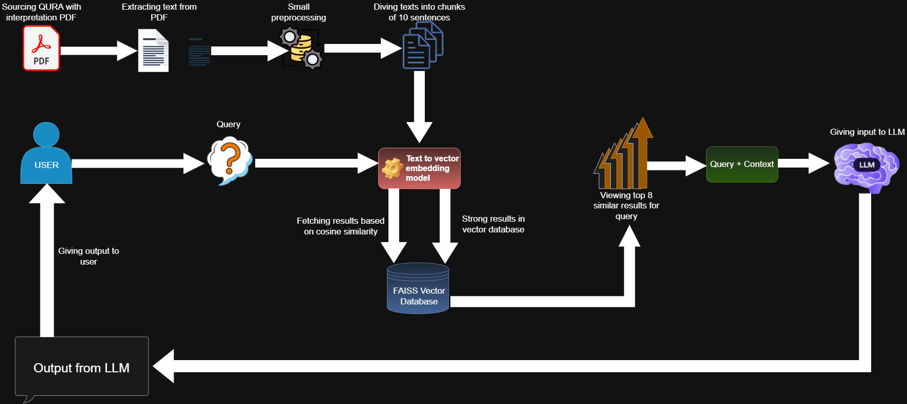

# 🕌 Quran Guider using RAG



A beginner‑friendly Retrieval‑Augmented Generation (RAG) project that answers questions about the Qur’an using a PDF of **“The Qur’an with Annotated Interpretation in Modern English – Ali Ünal”**, dense embeddings, FAISS as a vector database, and the a large language model.

Everything is implemented in a single Colab‑ready notebook:

> `QuranGuiderUsingRAG.ipynb`
> `LangChainVersion.ipynb`

---

## 🌟 Features

For Langchain version:

- Loading the pdf using langchain using **PyMuPDFLoader**.
- Splitted data into chunks using **RecursiveCharacterTextSplitter** with chunk size of **10,000**.
- Used embeddings model **sentence-transformers/all-MiniLM-L6-v2** to embed all the documents.
- Used **FAISS** vector database to sore the vectors.
- Loading the LLM **llama-3.3-70b-versatile** using **GROQ API**.
- Building prompts and chains using langchain and asking the questions.

For Beginner friendly version 

- Load and parse the Qur’an PDF page by page.
- Clean the text (remove inline numeric citations like `).22`) and split it into sentences.
- Create fixed‑size chunks of **10 sentences** (last chunk may be shorter).
- Generate dense embeddings for every chunk using **sentence-transformers/all-mpnet-base-v2**.
- Store embeddings in a **FAISS** index for fast similarity search.
- Load **Gemma‑2‑2B‑IT** in 4‑bit with `bitsandbytes` and Hugging Face Transformers.
- Answer English questions about the Qur’an by:
  1. Encoding the question.
  2. Retrieving the top‑8 most relevant chunks from FAISS.
  3. Building a prompt that includes the retrieved context.
  4. Letting Gemma generate a grounded answer.

---

## 📁 Project structure

├── `QuranGuiderUsingRAG.ipynb` # Main notebook (all code) <br>
├── `RAG_workflow.jpg` # RAG workflow diagram (used in README) <br>
└── `the-quran-with-annotated-interpretation-in-modern-english-ali-unal.pdf` # original book <br>
└── `LangChainVersion.ipynb` # langcahin version of all of the project with different embedding model and LLM. <br>

## ⚙️ Setup

### 1. Clone the repository

```bash
git clone https://github.com/SyedNajiullah/QuranGuiderUsingRAG.git
cd QuranGuiderUsingRAG
```
### 2. Add the Qur’an PDF

Add the pdf to root as the-quran-with-annotated-interpretation-in-modern-english-ali-unal.pdf

### 3. Install dependencies

Run the cell one by one it will automatically install all dependencies. You might need to restart the session once when the google gemma is loaded for the bitsandbytes error if encountered.


### 4. Hugging Face token (for Gemma)

Gemma is a **gated** model. To use `google/gemma-2-2b-it`:

1. Create a Hugging Face account and log in.  
2. Open the model page and accept the license:  
   - https://huggingface.co/google/gemma-2-2b-it  
3. Go to your tokens page:  
   - https://huggingface.co/settings/tokens  
4. Create a **fine‑grained token** with:
   - **Read** access to models.
   - Permission to access **public gated models**.
5. In your notebook, set:
   - HF_TOKEN = "hf_YourHuggingFaceToken"

If you are running the ***Lang chain version*** then make GROQ api using the following link: https://console.groq.com/keys <br>
Then paste it where the API is being called. 
